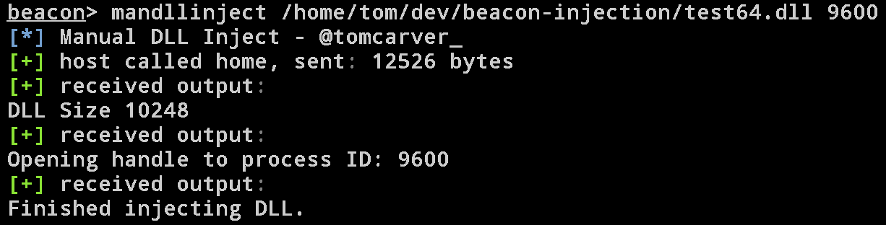

# XMAP
XMAP USING BOF DLL Inject is a custom [Beacon Object File](https://www.cobaltstrike.com/help-beacon-object-files) that uses manual map 
DLL injection in order to migrate a dll into a process all from memory. 

## Advantages
- Less likely to be signatured
- DLL payload stays in memory and never touches disk
- Additional functionality is easy to implement
- DLL isn't registered as a module including the EPROCESS structure in kernel land

